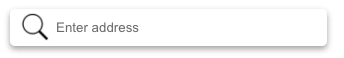
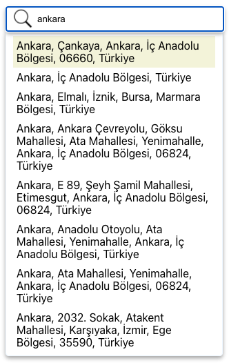

# react-osm-geocoding

> Find address locations via OSM Nominatim

[](https://www.npmjs.com/package/@paraboly/react-osm-geocoding) [](https://standardjs.com)



## Integration Example

## Install

```bash
npm install --save react-osm-geocoding
```

## Usage

```tsx
import React, { Component } from 'react'

import ReactOsmGeocoding from 'react-osm-geocoding'
import 'react-osm-geocoding/dist/index.css'

class Example extends Component {
  render() {
    return <ReactOsmGeocoding  callback={data => console.log(data)}/>
  }
}
```
## Details
*API:* ```https://nominatim.org/release-docs/develop/api/Search/```

| Props        | Definition     | Type  | Default  |
| ------------- |:-------------:| -----:|-----:|
| placeholder   | Placeholder for search input          | `string` | "Enter address" |
| debounce      | Debounce duration for the input in ms | `number` | 1000 |
| iconUrl       | Icon image url for the search icon    | `string` |  "https://cdn2.iconfinder.com/data/icons/ios-7-icons/50/search-512.png"|
| city          | Check Nominatim search API for details| `string` | "" |
| countrycode   | Check Nominatim search API for details | `string` | "tr" |
| acceptLanguage| Check Nominatim search API for details | `string` | "tr" |
| viewbox       | Bbox to filter query results, check Nominatim for more information | `<x1>,<y1>,<x2>,<y2>` | "" |
| callback      | Function returns selected address information | `Function` | undefined |

## License

MIT © [SchemeSonic](https://github.com/SchemeSonic)
